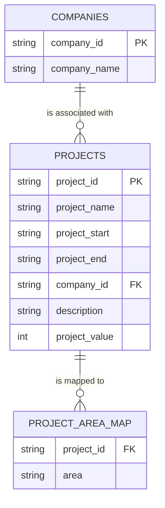

# Project Search API

A lightweight backend service built with FastAPI to serve project data with filtering, pagination, and sorting capabilities.

---

## 🚀 Features

- Filter projects by area (case-insensitive)
- Pagination support (defaults to page 1, 10 items per page)
- Sorted results:
  - project value (descending)
  - project name (ascending)
- Clean and structured JSON responses
- Input validation and error handling

---

## 🛠️ Tech Stack

- FastAPI
- SQLite
- Uvicorn

---

## Prerequisites

- Python 3.8+
- SQLite (database file `db.sqlite3` should be in the root directory)

## Setup and Installation

1. **Clone the Repository:**
   ```bash
   git clone https://github.com/veryresto/project-search-api.git
   cd project-search-api
   ```

2. **(Optional but Recommended) Create a Virtual Environment:**
   ```bash
   python3 -m venv venv
   source venv/bin/activate  # On macOS/Linux
   # venv\Scripts\activate  # On Windows
   ```

3. **Install Dependencies:**
   ```bash
   pip install -r requirements.txt
   ```

4. **Prepare Database:**
   
   Place your SQLite database file in the root directory.
   Default expected file name: `db.sqlite3`

5. **Run the Server:**
   ```bash
   uvicorn app.main:app --reload
   ```
   The server will start at `http://localhost:8000`.

## 🔗 Live Demo
 
 You can access the live API documentation here:
 - **Swagger UI:** [https://project-search-api.veryresto.com/docs](https://project-search-api.veryresto.com/docs)
 
 ---
 
 ## API Documentation

Once the server is running, you can access the interactive API docs:
- Swagger UI: `http://localhost:8000/docs`
- Redoc: `http://localhost:8000/redoc`

## Example Request

To fetch projects in Manchester:
```bash
curl "http://localhost:8000/projects?area=Manchester&page=1&per_page=10"
```

To see an error response (e.g., empty area):
```bash
curl "http://localhost:8000/projects?area="
# Response: {"detail":"Area must be provided and non-empty."}
```

## Implementation Details

### Assumptions
- **Area Match:** The `area` parameter is case-insensitive (e.g., searching for "london" will match "London").
- **Empty results:** If an area is valid but has no projects, the API returns a success response with an empty list and `total: 0`.
- **Error Response:** Validation errors (like an empty area) return a `400 Bad Request` with a JSON body containing a `detail` message.

### Tradeoffs
- **SQLite Direct Access:** For simplicity and performance in this specific task, raw SQL queries are used via the `sqlite3` built-in module instead of an ORM like SQLAlchemy. This keeps the binary small and dependencies minimal.
- **Project Structure:** Follows a standard tiered architecture (`main`, `service`, `db`, `schemas`) to ensure readability and maintainability.

### Sorting
Results are sorted by:
1. `project_value` DESC (high to low)
2. `project_name` ASC (alphabetical)

## Database Schema

The API interacts with the following tables in `db.sqlite3`:



### `projects`
- `project_id`: Unique identifier for the project.
- `project_name`: Name of the construction project.
- `project_start`: Projected start date/time.
- `project_end`: Projected end date/time.
- `company_id`: Foreign key to the `companies` table.
- `description`: Detailed description of the project.
- `project_value`: Monetary value of the project (used for sorting).

### `companies`
- `company_id`: Unique identifier for the company.
- `company_name`: Official name of the construction company.

### `project_area_map`
- `project_id`: Foreign key to the `projects` table.
- `area`: The geographic area associated with the project (used for filtering).
